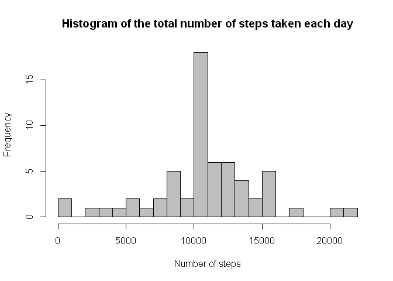

# Reproducible Research: Peer Assessment 1

<br/>


## Loading and preprocessing the data

```r
activity <- read.csv("activity.csv")
```


<br/>


## What is mean total number of steps taken per day?

```r
# Calculating totals and plotting histogram
totalSteps <- tapply(activity$steps, activity$date, FUN = sum, na.rm = TRUE)
hist(totalSteps, breaks = 20, col = "grey", main = "Histogram of the total number of steps taken each day", xlab = "Number of steps")
```

 

```r
# Mean and median values of total steps per day
mean(totalSteps, na.rm = TRUE)
```

```
## [1] 9354.23
```

```r
median(totalSteps, na.rm = TRUE)
```

```
## [1] 10395
```


<br/>


## What is the average daily activity pattern?

```r
# Aggregating steps as average per 5-minutes interval and making plot
avgSteps <- aggregate(steps ~ interval, data = activity, FUN = mean, na.rm = TRUE)
plot( avgSteps[,1], avgSteps[,2], type="l",
      main="Average steps per Interval", ylab="Number of steps", xlab="5-min. Interval")
```

 

```r
# Which 5-minute interval, on average across all the days in the dataset, contains the maximum number of steps?
maxInterval <- avgSteps[which.max(avgSteps[,2]),1]
maxInterval
```

```
## [1] 835
```


<br/>


## Imputing missing values

```r
# Calculate and report the total number of missing values
sum(is.na(activity))
```

```
## [1] 2304
```

```r
# Let's use average steps per interval (calculated in previous step) as substitution for missing data
fullData <- cbind(activity, avgSteps[,2])
names(fullData)[4] <- c("Substitute")
fullData$steps <- ifelse( is.na(fullData$steps), floor(fullData$Substitute), fullData$steps )

# Repeat calculations from the first step
totalSteps2 <- tapply(fullData$steps, fullData$date, FUN = sum, na.rm = TRUE)
hist(totalSteps2, breaks = 20, col = "grey", main = "Histogram of the total number of steps taken each day", xlab = "Number of steps")
```

 

```r
# Mean and median values of total steps per day
mean(totalSteps2, na.rm = TRUE)
```

```
## [1] 10749.77
```

```r
median(totalSteps2, na.rm = TRUE)
```

```
## [1] 10641
```
After applying substitutions for NA values the mean and median had increased compared to the first step above. 


<br/>


## Are there differences in activity patterns between weekdays and weekends?

```r
# Create a new variable indicating whether a given date is a weekday or weekend day
activityDayType <- fullData
activityDayType$day <- "weekday"
isWeekend <- weekdays(as.Date(activityDayType$date)) %in% c("Sunday", "Saturday")
activityDayType$day[isWeekend] <- "weekend"

# Aggregate by interval and day type
avgSteps2 <- aggregate(steps ~ interval + day, data = activityDayType, FUN = mean)

# Make panel plot
library(ggplot2)
```

```
## Warning: package 'ggplot2' was built under R version 3.1.3
```

```r
ggplot(avgSteps2, aes(interval, steps)) + geom_line() + facet_grid(day ~ .) + 
    xlab("5-min. interval") + ylab("Number of steps")
```

 

